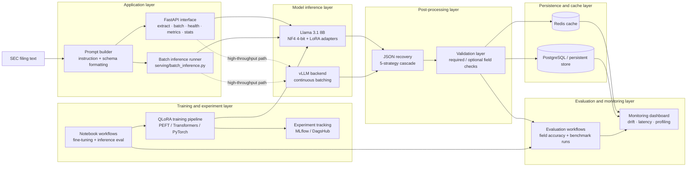

# Fine-Tuned-SEC-Filing-Extraction-Pipeline

**Untagged-prose extraction from SEC filings using QLoRA fine-tuned Llama 3.1 8B**

[](https://www.python.org/downloads/release/python-3120/)
[](https://ubuntu.com/engage/mlops-guide)
[](https://www.postgresql.org/docs/18/index.html)
[](https://huggingface.co/transformers)
[](https://en.wikipedia.org/wiki/MIT_License)
<!-- []() -->

"SEC filings contain valuable financial data buried in narrative prose — MD&A sections, footnotes, non-GAAP reconciliations, and untagged tables — that no general-purpose parser can reliably handle. This pipeline extracts structured data from that untagged text."

This project sits upstream within EDGAR/iXBRL ingestion, handling extraction of high-volume facts fro untagged filing text while preserving confidence, provenance, and model versioning.

---

## Table of Contents

- [Overview](#project-overview)
- [Architecture](#architecture)
- [Model and Fine-Tuning Approach](#model-and-fine-tuning-approach)
- [Extraction Output](#extraction-output)
- [Evidence and Benchmarks](#evidence-and-benchmarks)
- [Quickstart](#quickstart)
- [How to Run and Inspect the Work](#how-to-run-and-inspect-the-work)
- [Training and Notebooks](#training-and-notebooks)
- [Testing](#testing)
- [Monitoring](#monitoring)
- [Planned Integrations](#planned-integrations)
- [Limitations](#limitations)
- [Related Repositories](#related-repositories)
- [Citation](#citation)

---

## Project Overview

SEC filings are only partially structured. Even when companies provide iXBRL tags for core statement items, important disclosures and secondary metrics still appear in untagged prose, footnotes, and plain-text tables, where deterministic parsers break down. This repository targets that gap with an LLM-based extraction pipeline for converting unstructured SEC text into validated structured financial records. 

The system combines a QLoRA fine-tuned Llama 3.1 8B model with a 5-stage JSON fallback parser, schema validation, Redis caching, PostgreSQL persistence, and FastAPI endpoints for online and batch inference. Repo evidence includes 94% fully correct JSON outputs on a synthetic test set, 92–99% field-level accuracy, about 320 ms p50 latency, about 60 docs/min throughput, 7.2 GB NF4 memory usage versus 32 GB FP32, and 103 automated tests runnable without a GPU. 

This repo is best understood as the untagged-prose extraction layer in a broader SEC data stack: deterministic systems handle machine-tagged facts upstream, and this pipeline handles the ambiguous text that remains.

### Worktree

| Path | Purpose |
|------|---------|
| `src/` | Core extraction logic, including config loading, prompt construction, model wrappers, inference, normalization, post-processing, validation, routing, and persistence helpers |
| `serving/` | Runtime interfaces such as the FastAPI app, batch inference entrypoints, inference server wrappers, and request security helpers |
| `training/` | QLoRA training pipeline components, including callbacks, collators, and training entrypoints |
| `evaluation/` | Accuracy and benchmark utilities for extraction quality, latency, throughput, and reference-set evaluation |
| `monitoring/` | Drift checks, alerting, and dashboard-oriented monitoring workflows |
| `scripts/` | Operational utilities such as dataset generation, model download, Kaggle job submission and retrieval, EDGAR helpers, and SQL initialization scripts |
| `notebooks/` | GPU-oriented notebooks for fine-tuning, inference evaluation, latency profiling, and experimental validation |
| `data/` | Small local reference artifacts, including sample filing text and expected extraction outputs used for smoke tests and demos |
| `tests/` | Automated test coverage for parsing, validation, API behavior, persistence, routing, monitoring, and mocked end-to-end flows |
| `docs/` | Project documentation such as API contracts and architecture boundaries with upstream and downstream systems |
| `observability/` | Grafana, Prometheus, Loki, Promtail, and alerting configuration for operational visibility |
| `helm/` and `k8s/` | Deployment manifests and chart assets for containerized or cluster-based environments |
| `supabase/` | Early-stage Supabase integration area for managed persistence and future migration-based database workflows |

A few directories are especially important for new readers:

- Start in `src/` to understand the extraction pipeline itself.
- Use `notebooks/` if you want the fastest path to inspect training and inference behavior.
- Check `tests/` and `evaluation/` for the strongest evidence of correctness and measurement.

---

## Architecture

The pipeline is organized as a staged extraction system:




### Core components

| Component | Responsibility |
|----------|----------------|
| Prompt builder | Formats filing text into extraction instructions for the model |
| Fine-tuned model | Produces candidate structured output from narrative filing text |
| JSON recovery layer | Repairs malformed or partially formatted model responses |
| Validator | Enforces schema expectations and required fields |
| Cache and persistence | Supports serving efficiency and auditability |
| API layer | Exposes extraction endpoints and operational endpoints |
| Monitoring layer | Tracks latency, throughput, drift, and evaluation metrics |

### Serving modes

There are two intended serving paths:

- **Standard serving** for simpler local runs and development.
- **vLLM-backed serving** for higher-throughput inference with better batching behavior.

---

## Model and Fine-Tuning Approach

The base model is **Llama 3.1 8B**, selected as a middle ground between capability and deployability. It is large enough to follow extraction instructions on complex filing text, but still small enough to run on a single 16 GB class GPU with quantization.

### Why QLoRA

QLoRA allows domain adaptation without retraining or storing full-precision base weights. The approach freezes the base model, quantizes it to NF4 4-bit, and trains only low-rank adapter layers.

```text
Base model (frozen)
      │
      ├── NF4 4-bit quantization
      │
      ▼
LoRA adapters inserted into linear projections
      │
      ▼
Domain-adapted extraction model
```

### Training configuration

| Parameter | Value |
|----------|-------|
| Base model | Llama 3.1 8B |
| Quantization | NF4 4-bit + double quant |
| LoRA rank | 16 |
| LoRA alpha | 32 |
| Target modules | q / k / v / o / gate / up / down |
| Effective batch size | 32 |
| Learning rate | 5e-4 with cosine decay |

The goal is not to teach general financial language from scratch. The goal is to adapt a strong base model so it better understands how SEC filings present structured financial information in prose and semi-structured text.

---

## Extraction Output

The pipeline is designed to produce structured JSON from raw filing text. A typical output shape looks like this:

```json
{
  "filing_id": "uuid",
  "company_name": "Apple Inc.",
  "ticker": "AAPL",
  "filing_type": "10-K",
  "date": "2024-09-28",
  "fiscal_year_end": "2024-09-28",
  "revenue": 394328000000,
  "net_income": 99803000000,
  "total_assets": 364980000000,
  "total_liabilities": 308030000000,
  "eps": 6.42,
  "sector": "Technology"
}
```

### Parser recovery strategy

LLM output is not always valid JSON on the first pass. The post-processing layer applies a fallback cascade:

1. Direct parse
2. Strip code fences
3. Regex-based JSON extraction
4. Repair common truncation or formatting issues
5. Field-level fallback extraction

This design turns “model output” into something closer to a production extraction system rather than a demo that only works on perfect generations.

---

## Evidence and Benchmarks

The repository currently presents performance as a combination of notebook-based evaluation, field-level inspection, and operational benchmarking.

### Benchmark snapshot

| Metric | Value | Notes |
|--------|-------|-------|
| Extraction accuracy | 94% fully correct JSON outputs | Measured on synthetic test data |
| Field-level accuracy | 92%–99% per field | Measured on synthetic test data |
| Inference latency (p50) | ~320 ms / document | Notebook benchmark |
| Throughput | ~60 docs / min | Environment-dependent |
| Memory footprint | 7.2 GB | NF4 4-bit runtime footprint |
| Trainable parameters | ~200M / 8B | Approx. 2.5% of total model |
| Cost per document | ~$0.003 self-hosted estimate | Depends on serving environment |

### Evidence sources in the repo

- Notebook-based extraction evaluation.
- Latency profiling.
- GPU memory profiling.
- Drift monitoring and dashboard components.
- Automated tests for parsing, validation, API behavior, and integration logic.

### Important caveat

Current benchmark claims are based on **synthetic or template-derived evaluation data** unless otherwise noted. Real-world performance on authentic EDGAR filings should be treated as an open evaluation question until a curated real-filing benchmark is published in-repo.

---

## Quickstart

### 1. Clone the repository

```bash
git clone https://github.com/A-Kuo/Fine-Tuned-SEC-Filing-Extraction-Pipeline.git
cd Fine-Tuned-SEC-Filing-Extraction-Pipeline
```

### 2. Install dependencies

```bash
pip install -r requirements.txt
```

### 3. Configure environment variables

```bash
cp .env.example .env
```

Then add the variables you need for your path:

- `HF_TOKEN` or equivalent Hugging Face access token for gated model access
- `DAGSHUB_USER_TOKEN` if training runs are logged to DagsHub / MLflow
- `KAGGLE_USERNAME` and `KAGGLE_KEY` if using Kaggle for remote GPU runs

### 4. Start local dependencies

```bash
make infra-up
```

### 5. Prepare data and run checks

```bash
make data
make test
```

If your current branch still uses explicit DB initialization, run:

```bash
make db-init
```

If your branch is moving toward Supabase-managed schema instead, replace that step with the appropriate migration workflow and update this section accordingly.

---

## How to Run and Inspect the Work

This repository is easiest to inspect through four entry points.

### Option 1: Read the notebooks

The notebooks are the fastest way to understand the training and evaluation story:

- fine-tuning workflow
- inference evaluation
- latency and memory profiling
- GPU assumptions and notebook-specific setup

### Option 2: Run local serving

For a local extraction API:

```bash
make serve
```

If you are using the higher-throughput path:

```bash
make serve-vllm
uvicorn serving.api:app --host 0.0.0.0 --port 8001
```

### Option 3: Run a single extraction

```bash
curl -X POST http://localhost:8000/extract \
  -H "Content-Type: application/json" \
  -d '{"text": "SEC FILING - FORM 10-K\nRegistrant: Apple Inc.\n..."}'
```

Example response:

```json
{
  "ticker": "AAPL",
  "company_name": "Apple Inc.",
  "revenue": 394328000000,
  "net_income": 99803000000,
  "eps": 6.42,
  "filing_type": "10-K",
  "confidence": {
    "revenue": 0.97,
    "net_income": 0.95,
    "eps": 0.93
  }
}
```

### Option 4: Run batch inference

```bash
python serving/batch_inference.py \
  --input_dir data/filings/ \
  --server_url http://localhost:8000
```

---

## Training and Notebooks

Training requires GPU access. The repository supports both local GPU workflows and notebook-based remote compute.

### Local GPU path

```bash
python scripts/download_model.py
make train
```

Expected outcome:
- LoRA adapter artifacts saved locally
- metrics and training outputs logged through the configured experiment system

### Kaggle path

```bash
make train-kaggle
```

This path is intended for remote GPU execution where local hardware is not available.

### Notebook guide

| Notebook | Purpose | Minimum GPU |
|----------|---------|-------------|
| `notebooks/train_qlora.ipynb` | QLoRA fine-tuning | T4 (16 GB) |
| `notebooks/inference_eval.ipynb` | Extraction evaluation and profiling | T4 (16 GB) |

### What the notebooks are useful for

- validating the training loop on GPU
- inspecting output quality on sample filings
- measuring latency and memory usage
- demonstrating the end-to-end extraction flow outside local infra

---

## Testing

The test suite is intended to cover non-GPU logic so that CI can run on standard runners.

```bash
make test
make test-coverage
make lint
make typecheck
```

### Current test focus areas

| Test area | Focus |
|----------|-------|
| Post-processing | JSON parsing, recovery, validation |
| Monitoring | drift detection and evaluation metrics |
| Database / persistence | storage behavior and graceful degradation |
| Integration | non-GPU end-to-end flows |
| API | request / response schemas and prompt handling |
| Utilities | config and helper logic |

If you want the README to remain future-proof, avoid locking the top-level README to an exact test count unless that number is generated automatically in CI.

---

## Monitoring

The repository includes monitoring and evaluation utilities for both model quality and system behavior.

```bash
make dashboard
make monitor
make evaluate
make benchmark
```

These commands are intended to support:
- drift inspection
- evaluation against reference outputs
- latency and throughput benchmarking
- dashboard-based inspection of extraction behavior over time

If the public Streamlit drift dashboard is still active, link it here as an optional external artifact rather than relying on it as the only evidence source.

---

## Planned Integrations

This extraction system is designed to be one component in a broader financial intelligence stack.

Potential downstream consumers include:
- ticker-driven market intelligence agents
- aspect-based sentiment analysis over MD&A and risk-factor text
- dashboarding or agentic visualization layers
- persistence or registry layers for model outputs and extracted facts

This section should describe integrations as **planned**, **partial**, or **implemented** very explicitly. If a downstream system is not wired into the current branch, avoid language that implies automatic end-to-end orchestration already exists.

---

## Limitations

This repository has several important limitations.

- **Synthetic evaluation bias:** current benchmark claims rely heavily on synthetic or template-derived data.
- **Real-filing generalization is still the main open question:** performance on authentic EDGAR prose may differ materially.
- **Gated base model dependency:** some workflows depend on access to Llama 3.1 weights through Hugging Face.
- **Notebook execution can drift from the main branch:** notebook instructions need periodic reconciliation with the actual repo structure.
- **Infrastructure references may evolve:** if the project is transitioning from direct PostgreSQL initialization toward Supabase-managed migrations, setup instructions must stay aligned with the current branch.
- **Upstream dependency exists by design:** this repo is not a full SEC ingestion pipeline and depends on filing text being available from elsewhere.
- **Downstream integrations may be incomplete:** related systems can be discussed here, but should not be treated as fully operational unless present in this repository or explicitly linked with working interfaces.

For a fuller discussion of risks, assumptions, and intended use, keep `MODEL_CARD.md` aligned with this section.

---
<!--
## Related Repositories

| Repository | Role |
|-----------|------|
| [SEC EDGAR extraction pipeline](https://github.com/A-Kuo/sec-edgar-extraction-pipeline) | Upstream ingestion and deterministic iXBRL-tagged fact extraction |
| [Transformer Aspect-Based Sentiment Analysis](https://github.com/A-Kuo/Transformer-Aspect-Based-Sentiment-Analysis) | Planned downstream qualitative analysis over filing text |
| [Financial Economic Ticker Analyzer Agent](https://github.com/A-Kuo/Financial-Economic-Ticker-Analyzer-Agent) | Planned downstream market-intelligence enrichment |
| [Agentic Visualization Framework](https://github.com/A-Kuo/Agentic-Visualization-Framework) | Planned downstream visualization and dashboard generation |

---
-->
## Citation

```bibtex
@software{findoc_analyzer_2026,
  author = {A-Kuo},
  title = {Fine-Tuned SEC Filing Extraction Pipeline},
  url = {https://github.com/A-Kuo/Fine-Tuned-SEC-Filing-Extraction-Pipeline},
  year = {2026}
}
```

---

*Data is persistent. Data Science makes it useful.*
