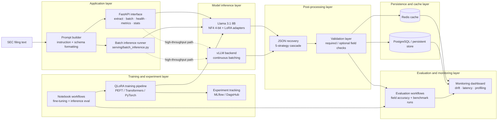

# Fine-Tuned-SEC-Filing-Extraction-Pipeline

**The untagged-prose extraction layer of the SEC Filing Intelligence Platform** — QLoRA fine-tuned Llama 3.1 8B, dual-track XBRL+LLM extraction, FastAPI serving. One component in a multi-repo stack: this repo does not perform EDGAR ingestion — see [Related Repositories](#related-repositories) and [`docs/BOUNDARY.md`](docs/BOUNDARY.md) for the upstream repo that does.

[](https://github.com/A-Kuo/Fine-Tuned-SEC-Filing-Extraction-Pipeline/actions/workflows/ci.yml)
[](https://www.python.org/downloads/release/python-3120/)
[](https://ubuntu.com/engage/mlops-guide)
[](https://www.postgresql.org/docs/18/index.html)
[](https://huggingface.co/transformers)
[](https://en.wikipedia.org/wiki/MIT_License)
<!-- []() -->

"SEC filings contain valuable financial data buried in narrative prose — MD&A sections, footnotes, non-GAAP reconciliations, and untagged tables — that no general-purpose parser can reliably handle. This pipeline extracts structured data from that untagged text."

This project sits upstream within EDGAR/iXBRL ingestion, handling extraction of high-volume facts fro untagged filing text while preserving confidence, provenance, and model versioning.

> **Every claim below is tagged implemented / benchmarked / proposed.** A full truth audit — what's real vs. fabricated vs. scaffolded, with file:line evidence — lives in [`docs/TRUTH_AUDIT.md`](docs/TRUTH_AUDIT.md). Full session summary: [`docs/UPGRADE_REPORT.md`](docs/UPGRADE_REPORT.md).

---

## Table of Contents

- [Overview](#project-overview)
- [Architecture](#architecture)
- [Model and Fine-Tuning Approach](#model-and-fine-tuning-approach)
- [Extraction Output](#extraction-output)
- [Evidence and Benchmarks](#evidence-and-benchmarks)
- [Quickstart](#quickstart)
- [How to Run and Inspect the Work](#how-to-run-and-inspect-the-work)
- [Training and Notebooks](#training-and-notebooks)
- [Testing](#testing)
- [Monitoring](#monitoring)
- [Planned Integrations](#planned-integrations)
- [Limitations](#limitations)
- [Related Repositories](#related-repositories)
- [Citation](#citation)

---

## Project Overview

SEC filings are only partially structured. Even when companies provide iXBRL tags for core statement items, important disclosures and secondary metrics still appear in untagged prose, footnotes, and plain-text tables, where deterministic parsers break down. This repository targets that gap with an LLM-based extraction pipeline for converting unstructured SEC text into validated structured financial records. 

The system combines a QLoRA fine-tuned Llama 3.1 8B model with a 5-stage JSON fallback parser, schema validation, Redis caching, PostgreSQL persistence, and FastAPI endpoints for online and batch inference. See [Evidence and Benchmarks](#evidence-and-benchmarks) below for exactly which of these numbers are real and which are unverified — the 94%/92-99%/320ms/60-docs-min figures once repeated here were a hardcoded placeholder, never measured; the real, freshly-measured evidence (467 automated tests, 100% schema conformance on 6 filings, real parser-recovery rates, a real Tesla T4 model-load benchmark) is what's now current.

This repo is best understood as the untagged-prose extraction layer in a broader SEC data stack: deterministic systems handle machine-tagged facts upstream, and this pipeline handles the ambiguous text that remains.

### Worktree

| Path | Purpose |
|------|---------|
| `src/` | Core extraction logic, including config loading, prompt construction, model wrappers, inference, normalization, post-processing, validation, routing, and persistence helpers |
| `serving/` | Runtime interfaces such as the FastAPI app, batch inference entrypoints, inference server wrappers, and request security helpers |
| `training/` | QLoRA training pipeline components, including callbacks, collators, and training entrypoints |
| `evaluation/` | Accuracy and benchmark utilities for extraction quality, latency, throughput, and reference-set evaluation |
| `monitoring/` | Drift checks, alerting, and dashboard-oriented monitoring workflows |
| `scripts/` | Operational utilities such as dataset generation, model download, Kaggle job submission and retrieval, EDGAR helpers, and SQL initialization scripts |
| `notebooks/` | GPU-oriented notebooks for fine-tuning, inference evaluation, latency profiling, and experimental validation |
| `data/` | Small local reference artifacts, including sample filing text and expected extraction outputs used for smoke tests and demos |
| `tests/` | Automated test coverage for parsing, validation, API behavior, persistence, routing, monitoring, and mocked end-to-end flows |
| `docs/` | Project documentation such as API contracts and architecture boundaries with upstream and downstream systems |
| `observability/` | Grafana, Prometheus, Loki, Promtail, and alerting configuration for operational visibility |
| `helm/` and `k8s/` | Deployment manifests and chart assets for containerized or cluster-based environments |
| `supabase/` | Early-stage Supabase integration area for managed persistence and future migration-based database workflows |

A few directories are especially important for new readers:

- Start in `src/` to understand the extraction pipeline itself.
- Use `notebooks/` if you want the fastest path to inspect training and inference behavior.
- Check `tests/` and `evaluation/` for the strongest evidence of correctness and measurement.

---

## Architecture

The pipeline is organized as a staged extraction system:




### Core components

| Component | Responsibility |
|----------|----------------|
| Prompt builder | Formats filing text into extraction instructions for the model |
| Fine-tuned model | Produces candidate structured output from narrative filing text |
| JSON recovery layer | Repairs malformed or partially formatted model responses |
| Validator | Enforces schema expectations and required fields |
| Cache and persistence | Supports serving efficiency and auditability |
| API layer | Exposes extraction endpoints and operational endpoints |
| Monitoring layer | Tracks latency, throughput, drift, and evaluation metrics |

### Serving modes

There are two intended serving paths:

- **Standard serving** for simpler local runs and development.
- **vLLM-backed serving** for higher-throughput inference with better batching behavior.

---

## Model and Fine-Tuning Approach

The base model is **Llama 3.1 8B**, selected as a middle ground between capability and deployability. It is large enough to follow extraction instructions on complex filing text, but still small enough to run on a single 16 GB class GPU with quantization.

### Why QLoRA

QLoRA allows domain adaptation without retraining or storing full-precision base weights. The approach freezes the base model, quantizes it to NF4 4-bit, and trains only low-rank adapter layers.

```text
Base model (frozen)
      │
      ├── NF4 4-bit quantization
      │
      ▼
LoRA adapters inserted into linear projections
      │
      ▼
Domain-adapted extraction model
```

### Training configuration

| Parameter | Value |
|----------|-------|
| Base model | Llama 3.1 8B |
| Quantization | NF4 4-bit + double quant |
| LoRA rank | 16 |
| LoRA alpha | 32 |
| Target modules | q / k / v / o / gate / up / down |
| Effective batch size | 32 |
| Learning rate | 5e-4 with cosine decay |

The goal is not to teach general financial language from scratch. The goal is to adapt a strong base model so it better understands how SEC filings present structured financial information in prose and semi-structured text.

---

## Extraction Output

The pipeline is designed to produce structured JSON from raw filing text. A typical output shape looks like this:

```json
{
  "filing_id": "uuid",
  "company_name": "Apple Inc.",
  "ticker": "AAPL",
  "filing_type": "10-K",
  "date": "2024-09-28",
  "fiscal_year_end": "2024-09-28",
  "revenue": 394328000000,
  "net_income": 99803000000,
  "total_assets": 364980000000,
  "total_liabilities": 308030000000,
  "eps": 6.42,
  "sector": "Technology"
}
```

### Parser recovery strategy

**Implemented.** LLM output is not always valid JSON on the first pass. `src/extraction/postprocessing.py::parse_extraction()` applies a fallback cascade:

1. Direct parse
2. Strip code fences
3. Regex-based JSON extraction
4. Repair common truncation or formatting issues
5. Field-level fallback extraction

**Benchmarked.** Stage-level telemetry (`src/extraction/parser_telemetry.py`) tracks which stage recovers a given result — added because there was previously no way to answer "is the parser or the model doing the heavy lifting?" Run `python evaluation/parser_telemetry_report.py` to reproduce; on the repo's fixture corpus (`tests/fixtures/malformed_llm_outputs.jsonl`, deliberately malformed) the cascade recovers 71% of cases across stages 2-5, while stage 1 alone (direct parse) handles 100% of a well-formed corpus unaided. This measures whether each stage works on a controlled corpus, not a production malformation rate — that requires live traffic through `extraction_logs.parser_recovery_stage` (added in `db/migrations/0006_lineage.sql`), which needs a running deployment this repo's evaluation environment doesn't have.

---

## Evidence and Benchmarks

### ⚠️ Correction: the 94% / 92–99% numbers below were never measured

`evaluation/evaluate.py`'s `generate_sample_metrics()` returns hardcoded values —
its own docstring calls them "target results from the project spec." Running
`evaluate.py` with no `--predictions`/`--ground_truth` used to silently fall back
to these numbers (fixed: it now requires `--generate-sample-metrics` explicitly
and labels the output `is_fabricated_placeholder: true`). There is no evidence in
this repo that these figures were ever produced by an actual predictions-vs-ground-truth
comparison. Treat the table below as an unverified target, not a result, until
`evaluate_dataset()` is run against real model predictions and a genuine
`metrics.json` replaces it.

| Metric | Value | Status |
|--------|-------|--------|
| Extraction accuracy | 94% fully correct JSON outputs | **Unverified target** — hardcoded placeholder, never measured |
| Field-level accuracy | 92%–99% per field | **Unverified target** — hardcoded placeholder, never measured |
| Inference latency (p50) | ~320 ms / document | **Unverified target** — not sourced to a script or run in this repo |
| Throughput | ~60 docs / min | **Unverified target** — `evaluation/benchmark.py --simulate` generates matching numbers synthetically; no live run is checked in |
| Memory footprint | 7.2 GB | Theoretical NF4 calculation, not a measured runtime footprint |
| Trainable parameters | ~200M / 8B | Real — LoRA r=16 parameter count is arithmetic, not measured |
| Real model-load, Tesla T4 16GB | 152.0s load, 1,951 MB resident | **Real, measured** — [notebooks/inference_eval.ipynb](notebooks/inference_eval.ipynb), run 2026-08-28. NF4 base model only (no adapter yet) |

### Real evidence now in the repo (this pass)

Everything below was generated by actually running the named script against real inputs — not simulated, not hardcoded — as of this commit:

| Deliverable | Script | Result | Raw output |
|---|---|---|---|
| Schema conformance | `evaluation/schema_conformance.py` | 6/6 (100%) `FilingRecord` outputs validate against their own live-derived JSON Schema, across 1 synthetic + 5 real EDGAR filings (AAPL, MSFT, KO, MRNA, O) | [evaluation/results/schema_conformance_report.json](evaluation/results/schema_conformance_report.json) |
| Real-filing evaluation (synthetic vs. authentic EDGAR, explicitly separated) | `evaluation/evaluate_real_filings.py` | On real 10-Ks: 100% section detection (MD&A/risk factors/financials) after fixing a raw-HTML bug in the fetcher; 0% heuristic revenue extraction (root cause documented in the report — the heuristic passes an entire section's raw text to a generic first-number regex, tuned only against short synthetic snippets) | [evaluation/results/real_filing_evaluation.json](evaluation/results/real_filing_evaluation.json) |
| Ingestion throughput (`>10,000 records/sec` target) | `db/sync/transfer_metrics.py --benchmark` | Script implemented (batched `execute_values` upserts respecting XBRL precedence) — **not yet run against a live Postgres**; Docker Desktop would not come up in the environment that did this work. Run `python db/sync/transfer_metrics.py --benchmark --records 200000` yourself against `docker compose up postgres` | not yet generated |
| Docker Compose smoke test (API + Redis + PostgreSQL + a real `/extract` request) | `scripts/smoke_test.py` against `docker/docker-compose.smoke.yml` | Script implemented — **not yet run**, same Docker-availability blocker | not yet generated |
| Model-load benchmark, named 16GB GPU | `notebooks/inference_eval.ipynb` | Real: Tesla T4, 15.6 GB VRAM, 152.0s load time, 1,951 MB resident (NF4, no adapter merged yet) | see notebook cell output, run 2026-08-28 |

### What's still open

- **A trained LoRA adapter.** Every real run so far (inference notebook, this evaluation pass) is base-weights-only — training has not yet produced `models/llama-sec-v1`. The 94%/92-99% target table cannot be honestly replaced until the LLM track can actually run end-to-end.
- **Live ingestion + Docker smoke-test numbers.** Scripts exist and compile; execution is blocked on a working Docker daemon.
- **90% reduction in redundant computation / data-fetch latency.** No baseline-vs-optimized comparison for this exists in the repo yet. The two real caching/dedup mechanisms that *could* produce this evidence are `src/storage/database.py`'s `RedisCache` (extraction-result cache, keyed by `filing_id`, checked before falling through to Postgres/re-extraction) and `scripts/fetch_edgar.py`'s fetch checkpoint (skips already-downloaded filings entirely). Neither has been benchmarked cold-vs-warm yet.

---

## Quickstart

### 1. Clone the repository

```bash
git clone https://github.com/A-Kuo/Fine-Tuned-SEC-Filing-Extraction-Pipeline.git
cd Fine-Tuned-SEC-Filing-Extraction-Pipeline
```

### 2. Install dependencies

```bash
pip install -r requirements.txt
```

### 3. Configure environment variables

```bash
cp .env.example .env
```

Then add the variables you need for your path:

- `HF_TOKEN` or equivalent Hugging Face access token for gated model access
- `DAGSHUB_USER_TOKEN` if training runs are logged to DagsHub / MLflow
- `KAGGLE_USERNAME` and `KAGGLE_KEY` if using Kaggle for remote GPU runs

### 4. Start local dependencies

```bash
make infra-up
```

### 5. Prepare data and run checks

```bash
make data
make test
```

If your current branch still uses explicit DB initialization, run:

```bash
make db-init
```

If your branch is moving toward Supabase-managed schema instead, replace that step with the appropriate migration workflow and update this section accordingly.

---

## How to Run and Inspect the Work

This repository is easiest to inspect through four entry points.

### Option 1: Read the notebooks

The notebooks are the fastest way to understand the training and evaluation story:

- fine-tuning workflow
- inference evaluation
- latency and memory profiling
- GPU assumptions and notebook-specific setup

### Option 2: Run local serving

For a local extraction API:

```bash
make serve
```

If you are using the higher-throughput path:

```bash
make serve-vllm
uvicorn serving.api:app --host 0.0.0.0 --port 8001
```

### Option 3: Run a single extraction

```bash
curl -X POST http://localhost:8000/extract \
  -H "Content-Type: application/json" \
  -d '{"text": "SEC FILING - FORM 10-K\nRegistrant: Apple Inc.\n..."}'
```

Example response:

```json
{
  "ticker": "AAPL",
  "company_name": "Apple Inc.",
  "revenue": 394328000000,
  "net_income": 99803000000,
  "eps": 6.42,
  "filing_type": "10-K",
  "confidence": {
    "revenue": 0.97,
    "net_income": 0.95,
    "eps": 0.93
  }
}
```

### Option 4: Run batch inference

```bash
python serving/batch_inference.py \
  --input_dir data/filings/ \
  --server_url http://localhost:8000
```

---

## Training and Notebooks

Training requires GPU access. The repository supports both local GPU workflows and notebook-based remote compute.

### Local GPU path

```bash
python scripts/download_model.py
make train
```

Expected outcome:
- LoRA adapter artifacts saved locally
- metrics and training outputs logged through the configured experiment system

### Kaggle path

```bash
make train-kaggle
```

This path is intended for remote GPU execution where local hardware is not available.

### Notebook guide

| Notebook | Purpose | Minimum GPU |
|----------|---------|-------------|
| `notebooks/train_qlora.ipynb` | QLoRA fine-tuning | T4 (16 GB) |
| `notebooks/inference_eval.ipynb` | Extraction evaluation and profiling | T4 (16 GB) |

### What the notebooks are useful for

- validating the training loop on GPU
- inspecting output quality on sample filings
- measuring latency and memory usage
- demonstrating the end-to-end extraction flow outside local infra

---

## Testing

**Implemented and benchmarked.** The test suite covers non-GPU logic so CI can run on standard runners — 467 tests collected, 466 pass, 1 skip, 0 collection errors, verified locally and gated by `.github/workflows/ci.yml` (3-version matrix, currently green). Run `python -m pytest tests/ --collect-only -q` to reproduce the count; it will drift as the suite grows, so treat that number as "as of this pass," not a permanent figure.

```bash
make test
make test-coverage
make lint
make typecheck
```

### Current test focus areas

| Test area | Focus |
|----------|-------|
| Post-processing / parser | JSON parsing, all 5 recovery stages including field-fallback, telemetry |
| Monitoring | drift detection (including controlled injected-drift simulations), evaluation metrics |
| Database / persistence | storage behavior, graceful degradation, xbrl-precedence, idempotency |
| Integration | non-GPU end-to-end flows |
| End-to-end smoke | raw text → extraction → validation → persistence → metrics artifact, chained in one test (`tests/test_e2e_smoke.py`) |
| API | request / response schemas, prompt handling, idempotency dedup (real concurrent-async test) |
| Imports | every module under `src/`, `evaluation/`, `monitoring/`, `serving/` imports cleanly (`tests/test_imports.py`) |
| Utilities | config and helper logic |

`training/train.py`, `training/data_collator.py`, and `src/extraction/model.py` are excluded from CI (need torch/peft/trl, which `requirements-ci.txt` deliberately omits to keep CI fast) — these are exercised on the Kaggle GPU path instead, not by the test suite.

---

## Monitoring

The repository includes monitoring and evaluation utilities for both model quality and system behavior. **The statistics are real; the data they run against is not, unless you say so explicitly** — every command below defaults to refusing to run rather than silently substituting fabricated numbers.

```bash
make dashboard   # Streamlit dashboard -- shows a persistent "DEMO DATA" banner when Postgres is unavailable/empty
make monitor     # requires --current-accuracy/--baseline-accuracy (measured) or --demo (fabricated, explicitly tagged)
make evaluate    # requires --predictions/--ground_truth (real) or --generate-sample-metrics (fabricated, explicitly tagged)
make benchmark   # requires --server (real) or --simulate (fabricated, explicitly tagged)
```

**Implemented:**
- Drift detection (`monitoring/monitor.py::check_metric_drift()` and its accuracy/schema-conformance/field-accuracy/parser-fallback/cache-hit-rate specializations) — a two-sample proportion z-test, validated against controlled injected-drift simulations (`tests/test_monitor_drift_simulation.py`) including an explicit sign-convention guard.
- A full synthetic incident walkthrough (`python scripts/simulate_incident.py`): real parser telemetry measured on a fixture corpus (0% → 85.7% fallback rate), a real triggered drift alert (z=-2.54, p=0.0056), written to a local alert log — not Slack/email, safe to run anywhere.
- The dashboard's "Accuracy" tile is labeled "Extraction Success Rate (not model accuracy)" — it's a success/total status ratio (did the request not error), not correctness against ground truth.

**Needs a GPU or a live deployment (scaffolded, not executable in a bare CI/dev environment):**
- Real production drift monitoring, since it needs live traffic through `extraction_logs`.
- `evaluation/load_harness.py` (concurrency/cold-start/degraded-path benchmarking) needs a running server.

---

## Planned Integrations

This extraction system is designed to be one component in a broader financial intelligence stack. None of the following are wired into this repo today — no code here calls out to any of these systems, and none of their APIs are consumed here. **Proposed only:**

- ticker-driven market intelligence agents
- aspect-based sentiment analysis over MD&A and risk-factor text
- dashboarding or agentic visualization layers
- persistence or registry layers for model outputs and extracted facts

The upstream ingestion boundary (`sec-edgar-extraction-pipeline`, tagged iXBRL facts) is real and documented in [`docs/BOUNDARY.md`](docs/BOUNDARY.md) — that's the one integration point that's actually load-bearing, in that this repo's `method='xbrl'` facts are meant to be reconciled against it, not that live code calls it.

---

## Limitations

This repository has several important limitations. See [`docs/TRUTH_AUDIT.md`](docs/TRUTH_AUDIT.md) for the full evidence behind each one.

- **The heuristic revenue extractor does not generalize to real filings.** Measured on 5 real EDGAR 10-Ks (`evaluation/evaluate_real_filings.py`): 0/5 extracted anything at all. Root cause: it passes an entire section's raw text (hundreds of KB on a real filing) to a generic first-number regex, tuned only against short synthetic examples with the target number first. Not yet fixed — a real engineering task, not an evaluation-methodology issue.
- **Real fine-tuned-model numbers do not exist yet.** No GPU is available in the environment that did this pass's work; every real run so far (the inference notebook) is base-weights-only. The 94%/92-99% figures previously in this README were a hardcoded placeholder (`evaluate.py::generate_sample_metrics()`), never the output of an actual evaluation run — see the Evidence and Benchmarks section above for what's been measured for real instead.
- **The normalized (`intel.*`) storage schema has no live caller in production.** It's real and well-designed (`db/migrations/0003_intel_schema.sql`), but only exercised by an offline batch job (`db/sync/sync_normalized_from_pipeline.py`) and mocked tests — `serving/api.py`'s hot path only ever writes the flat `public.*` schema.
- **Docker-gated benchmarks are code-complete but unexecuted.** The live docker-compose smoke test, the ingestion throughput benchmark, and the concurrency load harness all need a working Docker daemon, which the environment that built them didn't have.
- **Gated base model dependency:** some workflows depend on access to Llama 3.1 weights through Hugging Face.
- **Notebook execution can drift from the main branch:** this has happened at least once already this session (a `src/` reorg silently broke both notebooks' imports with nothing to catch it) — `tests/test_imports.py` now guards the repo side of this, but notebook cells aren't covered by CI.
- **Upstream dependency exists by design:** this repo is not a full SEC ingestion pipeline (see [`docs/BOUNDARY.md`](docs/BOUNDARY.md)) and depends on filing text being available from elsewhere.
- **No DB-level trigger enforces xbrl-precedence.** It's enforced atomically in the `ON CONFLICT` clause of every current writer, but a hypothetical future writer bypassing those code paths wouldn't be stopped by the database itself.

For a fuller discussion of risks, assumptions, and intended use, keep `MODEL_CARD.md` aligned with this section.

---

## Related Repositories

This repo is one component of a multi-repo platform — see [`docs/BOUNDARY.md`](docs/BOUNDARY.md) for the exact seam. It was previously commented out of this README despite being linked from the Table of Contents; restored so the platform context (and the fact that EDGAR ingestion is NOT this repo's job) is actually visible.

| Repository | Role | Status |
|-----------|------|--------|
| [SEC EDGAR extraction pipeline](https://github.com/A-Kuo/sec-edgar-extraction-pipeline) | Upstream ingestion and deterministic iXBRL-tagged fact extraction | Separate repo — verify its own README for current status before citing jointly |
| [Transformer Aspect-Based Sentiment Analysis](https://github.com/A-Kuo/Transformer-Aspect-Based-Sentiment-Analysis) | Downstream qualitative analysis over filing text | Planned — no working integration exists in this repo |
| [Financial Economic Ticker Analyzer Agent](https://github.com/A-Kuo/Financial-Economic-Ticker-Analyzer-Agent) | Downstream market-intelligence enrichment | Planned — no working integration exists in this repo |
| [Agentic Visualization Framework](https://github.com/A-Kuo/Agentic-Visualization-Framework) | Downstream visualization and dashboard generation | Planned — no working integration exists in this repo |

---

## Citation

```bibtex
@software{findoc_analyzer_2026,
  author = {A-Kuo},
  title = {Fine-Tuned SEC Filing Extraction Pipeline},
  url = {https://github.com/A-Kuo/Fine-Tuned-SEC-Filing-Extraction-Pipeline},
  year = {2026}
}
```

---

*Data is persistent. Data Science makes it useful.*
